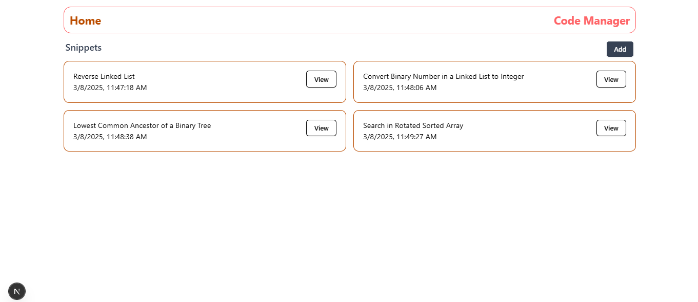

# Next.js 2025

This github repo contains so many nextjs beginner projects throughout the all learning journey.

## 1.) next-routing

This repo is all about routes and their implementation.

```bash
nextjs\next-routing> npm run dev
```

## 2.) Code Manager (code-snippet)
We are using **Prisma** and **sqlite3** for storing data and we **@monaco-editor/react** for code editor.

This repo is about store codes with edit and delete functionality. We are using dynamic routes and so many next.js core features like client and server pages with their importance. 



## License

[MIT](https://choosealicense.com/licenses/mit/)